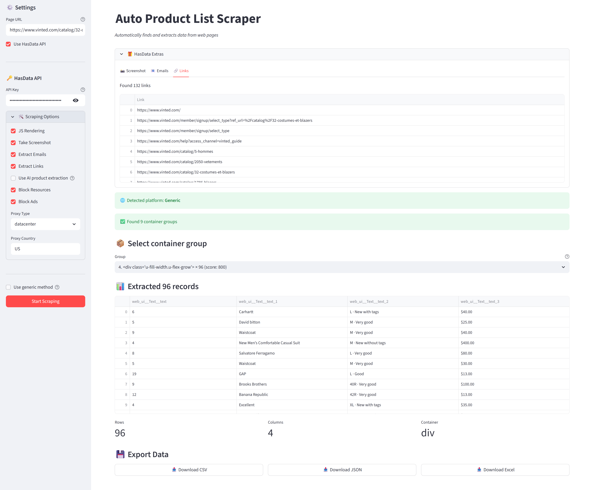

# Auto E-commerce Scraper

 

[](https://hasdata.com/?utm_source=github&utm_medium=syndication&utm_campaign=ecommerce-web-scraping-guide&utm_content=auto-ecommerce-scraper-readme)

A universal web scraper for e-commerce sites with automatic platform detection and intelligent data extraction.

## Table of Contents

- [Auto E-commerce Scraper](#auto-e-commerce-scraper)
- [Features](#features)
- [Architecture](#architecture)
- [Installation](#-installation)
  - [Requirements](#requirements)
- [Usage](#usage)
  - [Basic Usage](#basic-usage)
  - [With HasData API](#with-hasdata-api)
- [How It Works](#how-it-works)
  - [1. Platform Detection](#1-platform-detection)
  - [2. Container Detection (Generic Mode)](#2-container-detection-generic-mode)
  - [3. Data Extraction](#3-data-extraction)
  - [4. Data Cleaning](#4-data-cleaning)
- [API Reference](#api-reference)
  - [AutoScraper Class](#autoscraper-class)
  - [Platform-Specific Scrapers](#platform-specific-scrapers)
- [Examples](#examples)
  - [Scraping a WooCommerce Store](#scraping-a-woocommerce-store)
  - [Using AI Extraction](#using-ai-extraction)
- [Tested Sites](#tested-sites)
- [Configuration](#configuration)
  - [Scraping Options](#scraping-options)
  - [AI Extraction Rules](#ai-extraction-rules)
- [Links](#-links)
- [Disclaimer](#disclaimer)
- [Troubleshooting](#troubleshooting)
  - [Common Issues](#common-issues)


## Features



-  **Intelligent Container Detection** - Finds repeating product cards without configuration
-  **HasData API Integration** - Optional API support for JavaScript rendering and advanced features
-  **AI Extraction** - Extract structured product data using AI (via HasData)
-  **Multiple Export Formats** - Export to CSV, JSON, and Excel
-  **User-Friendly Interface** - Built with Streamlit for easy interaction

##  Architecture

One entry point, one package, no framework beyond Streamlit.

```
.
├── app.py                  # Main application entry point
├── scraper/
│   ├── core.py            # AutoScraper class and main logic
│   ├── platforms.py       # Platform-specific scrapers (WooCommerce, Shopify)
│   └── utils.py           # Helper functions for container detection
└── ui/
    ├── layout.py          # Sidebar and results rendering
    └── export.py          # Data export functionality
```

The `scraper` package works standalone, `app.py` only adds the UI.

## 📦 Installation

Clone the repository and install the dependencies.

```bash
# Clone the repository
git clone https://github.com/hasdata/auto-ecommerce-scraper.git
cd auto-ecommerce-scraper

# Install dependencies
pip install -r requirements.txt
```

No build step follows, the app runs from source.

### Requirements

The list in `requirements.txt` is the whole footprint.

```txt
streamlit>=1.30.0
pandas>=2.0.0
beautifulsoup4>=4.12.0
requests>=2.31.0
openpyxl>=3.1.0
```

Python 3.11 or newer.

##  Usage

The tool runs as a local Streamlit app.

### Basic Usage

Start the app and open the printed local URL.

```bash
streamlit run app.py
```

Then:
1. Enter a product listing page URL
2. Click "Start Scraping"
3. Review extracted data
4. Export to your preferred format

### With HasData API

For JavaScript-heavy sites or AI extraction:

1. Check "Use HasData API"
2. Enter your API key
3. Configure scraping options:
   - JS Rendering
   - Proxy settings
   - AI product extraction
   - Screenshot capture
   - Email/link extraction

##  How It Works

Each stage hands over to a fallback when it comes up empty.

### 1. Platform Detection

The scraper identifies the platform from the page source. WooCommerce shows itself through `woocommerce` and `product_type_` class prefixes, Shopify through its asset host and `product-card` markup, and everything else goes down the generic route.

For Shopify the scraper asks the storefront's own `/products.json` before touching the HTML, and for any platform it tries schema.org Product microdata before falling back to container detection.

### 2. Container Detection (Generic Mode)

Scores potential product containers based on:
- Presence of images and links
- Text content length
- HTML structure complexity
- CSS class keywords
- Price indicators

### 3. Data Extraction

Extracts:
- Product titles
- Prices and original prices
- Product URLs
- Images
- Stock status
- Categories and tags
- SKUs
- Ratings and reviews

### 4. Data Cleaning

- Groups similar fields
- Removes low-frequency selectors
- Creates human-readable field names
- Handles links and images properly

## API Reference

The package is importable outside the UI.

### AutoScraper Class

The class carries the whole pipeline.

```python
from scraper.core import AutoScraper

# Initialize scraper
scraper = AutoScraper(
    url="https://example.com/products",
    api_key="your_hasdata_key",  # Optional
    scrape_config={
        "jsRendering": True,
        "proxyType": "datacenter",
        "blockAds": True
    }
)

# Scrape data
result = scraper.scrape(
    container_index=0,      # Select container group
    force_generic=False     # Force generic method
)

# Access results
print(result['platform'])   # 'woocommerce', 'shopify', or 'generic'
print(result['data'])       # List of extracted items
```

The result dict names the platform it detected.

### Platform-Specific Scrapers

Each route is callable on its own.

```python
from scraper.platforms import (
    scrape_woocommerce,
    scrape_shopify,
    scrape_shopify_products_json,
    scrape_microdata,
)

# WooCommerce card parsing
result = scrape_woocommerce(scraper)

# Shopify: the storefront's own /products.json first, HTML cards second
result = scrape_shopify_products_json(scraper)
result = result or scrape_shopify(scraper)

# schema.org Product microdata, works on any platform that marks its cards
result = scrape_microdata(scraper)
```

On a Shopify store the JSON route replaces the whole card parse. One paginated request returns title, handle, price, SKU, vendor and image per product, verified on two live stores at 50 of 50 products each. Microdata runs before the generic container fallback, so a marked-up theme parses with zero site-specific selectors.

##  Examples

The two snippets below match the two ways people run the tool.

### Scraping a WooCommerce Store

The minimal run needs only a URL.

```python
scraper = AutoScraper("https://scrapeme.live/shop/")
result = scraper.scrape()

# result will contain:
# {
#   'platform': 'woocommerce',
#   'count': 48,
#   'data': [
#     {
#       'title': 'Product Name',
#       'price': '$19.99',
#       'url': 'https://...',
#       'image': 'https://...',
#       'stock_status': 'In Stock'
#     },
#     ...
#   ]
# }
```

The platform parser picks the fields, no schema needed.

### Using AI Extraction

AI rules trade credits for structure on messy layouts.

```python
from scraper.core import UNIVERSAL_PRODUCT_RULES

scraper = AutoScraper(
    url="https://example.com/products",
    api_key="your_key",
    scrape_config={
        "jsRendering": True,
        "aiExtractRules": UNIVERSAL_PRODUCT_RULES
    }
)

result = scraper.scrape()
ai_data = scraper.get_hasdata_extras()['aiResponse']
```

The AI rules return one structured object per detected product.

## Tested Sites

- ✅ WooCommerce stores
- ✅ Shopify stores
- ✅ Custom e-commerce platforms
- ✅ Book stores (books.toscrape.com)
- ✅ Fashion marketplaces (Vinted)
- ✅ And many more...

##  Configuration

Everything below passes through to the HasData request.

### Scraping Options

The table lists what the UI exposes.

| Option | Description | Default |
|--------|-------------|---------|
| `jsRendering` | Enable JavaScript rendering | `true` |
| `screenshot` | Capture page screenshot | `false` |
| `extractEmails` | Extract email addresses | `false` |
| `extractLinks` | Extract all links | `false` |
| `blockResources` | Block images/fonts/media | `true` |
| `blockAds` | Block advertisements | `true` |
| `proxyType` | Proxy type (datacenter/residential/mobile) | `datacenter` |
| `proxyCountry` | Proxy country code | `US` |

Unset options keep the API defaults.

### AI Extraction Rules

Define custom extraction schemas:

```python
custom_rules = {
    "products": {
        "type": "list",
        "description": "all products",
        "output": {
            "name": {"type": "string"},
            "price": {"type": "string"},
            "rating": {"type": "number"}
        }
    }
}
```

Any JSON schema in this shape works as a rule set.

## 🔗 Links

- [E-Commerce Web Scraping Guide](https://hasdata.com/blog/ecommerce-web-scraping-guide?utm_source=github&utm_medium=syndication&utm_campaign=ecommerce-web-scraping-guide&utm_content=auto-ecommerce-scraper-readme)
- [HasData API Documentation](https://docs.hasdata.com/introduction?utm_source=github&utm_medium=syndication&utm_campaign=ecommerce-web-scraping-guide&utm_content=auto-ecommerce-scraper-readme)

## Disclaimer

This tool is for **educational purposes** only. Learn more about [the legality of web scraping](https://hasdata.com/blog/is-web-scraping-legal?utm_source=github&utm_medium=syndication&utm_campaign=ecommerce-web-scraping-guide&utm_content=auto-ecommerce-scraper-readme).

## Troubleshooting

Three failure shapes account for nearly every report.

### Common Issues

**"Could not find repeating structures"**
- Try checking "Use generic method"
- The page needs several similar items for detection to lock on
- Try with HasData API for JS-rendered content

**"API Error"**
- Verify your HasData API key
- Check your API quota
- Check the URL opens in a normal browser first

**Empty or incomplete data**
- Select a different container group
- Enable JS rendering
- Check if the site requires authentication

---

Made with ❤️ for the web scraping community